<div align="center">

<h1>
  <picture>
    <source media="(prefers-color-scheme: dark)" srcset="docs/images/logo-dark.svg">
    
  </picture>
</h1>

### Watch a tumour outsmart its treatment, one cell at a time.

A 3D simulator of how cancers evolve drug resistance, calibrated on public lab data,<br>
where every cell that divides, mutates or dies can tell you why.

### [**▶ Open the live simulator at iressa.quicx.dev**](https://iressa.quicx.dev/)

[](https://iressa.quicx.dev/)
[](https://github.com/SborJ/Iressa/actions/workflows/ci.yml)
[](LICENSE)


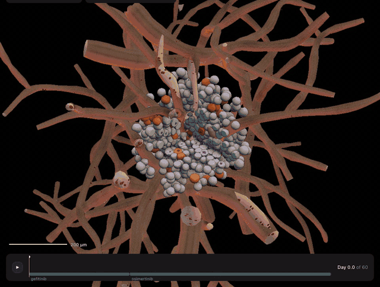

<sub>Sixty simulated days. Grey cells are drug-sensitive. Orange carries T790M and shrugs off gefitinib.<br>The treatment switches on day 20, and tan (C797S) and purple (MET-amplified) clones take over.</sub>

[**Live demo**](#try-it-live) ·
[**Quick start**](#quick-start) ·
[**What you can do**](#what-you-can-do) ·
[**How it works**](#how-it-works) ·
[**Code map**](#code-map) ·
[**The science**](#the-science) ·
[**Docs**](#documentation)

</div>

---

## The pill works. Then it doesn't.

Targeted cancer drugs can melt a tumour in weeks. Then, months later, it comes
back, and the drug that worked no longer does. Nothing new arrived from
outside: a handful of cells already carried, or picked up while dividing, the
one mutation that makes them immune. The treatment killed their competition
and handed them the tissue.

Iressa makes that process something you can watch, pause, cut open and
question. This is one recorded run of the calibrated engine, start to finish:

<table>
<tr>
<td width="25%">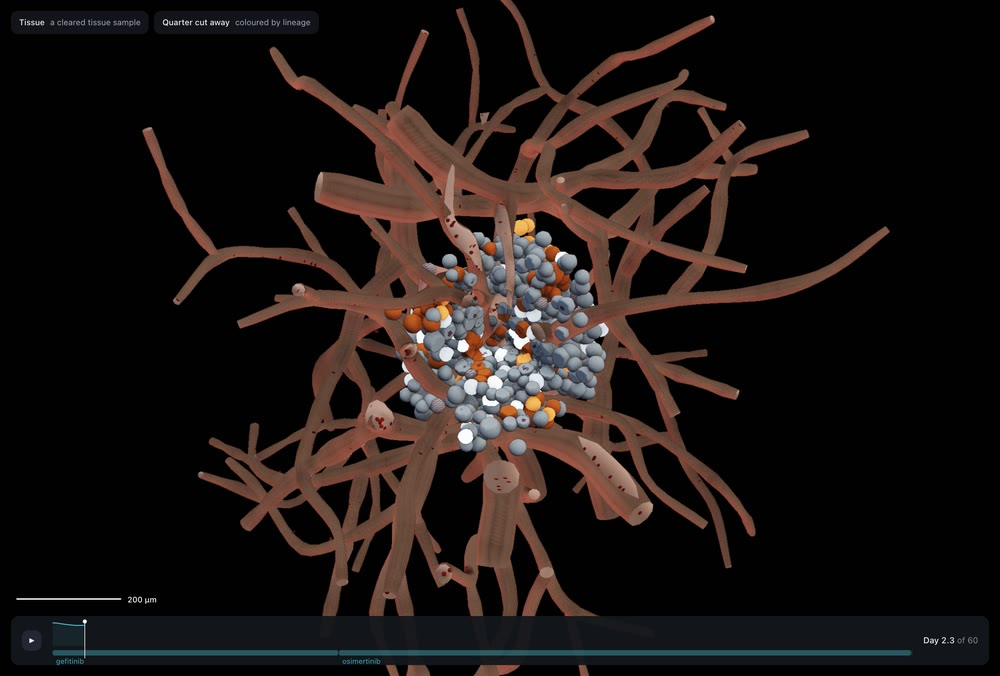</td>
<td width="25%"></td>
<td width="25%">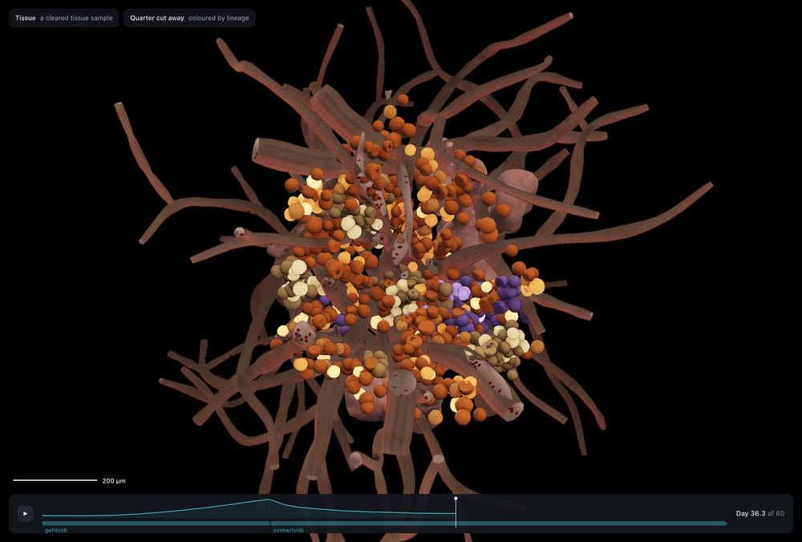</td>
<td width="25%">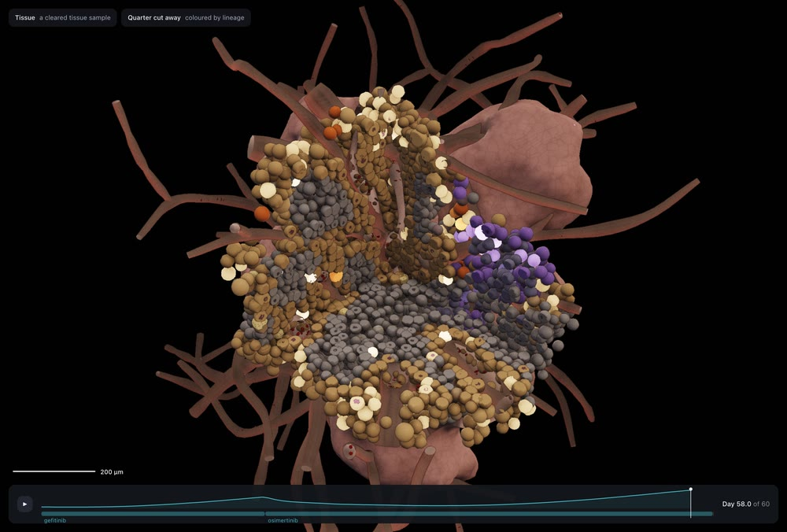</td>
</tr>
<tr>
<td valign="top"><b>Day 2 · Gefitinib</b><br>The tumour is drug-sensitive (grey). A few T790M cells (orange) are already there.</td>
<td valign="top"><b>Day 19 · Relapse</b><br>The sensitive cells are gone. T790M owns the tumour, and its core is starving.</td>
<td valign="top"><b>Day 36 · Osimertinib</b><br>The switch on day 20 hits T790M hard. Two new clones survive it.</td>
<td valign="top"><b>Day 58 · Relapse again</b><br>C797S (tan) and MET amplification (purple) rebuild the tumour.</td>
</tr>
</table>

None of that sequence is scripted. It falls out of growth rates, drug
sensitivities, oxygen supply and mutation odds, all of which live in data
files you can edit.

## Try it live

Iressa is running at **[iressa.quicx.dev](https://iressa.quicx.dev/)**. Nothing to install.

| | |
|---|---|
| [iressa.quicx.dev](https://iressa.quicx.dev/) | The landing page: the idea in a minute, open to everyone |
| [iressa.quicx.dev/simulation/](https://iressa.quicx.dev/simulation/) | The simulator. Create a free researcher account or sign in, then explore |
| [iressa.quicx.dev/simulation/?cancer=breast_er_her2neg](https://iressa.quicx.dev/simulation/?cancer=breast_er_her2neg) | The same, opening on the breast cancer model |

It needs a desktop browser with WebGL2. Everything below, including the AI
agent, works on the hosted version.

## What you can do

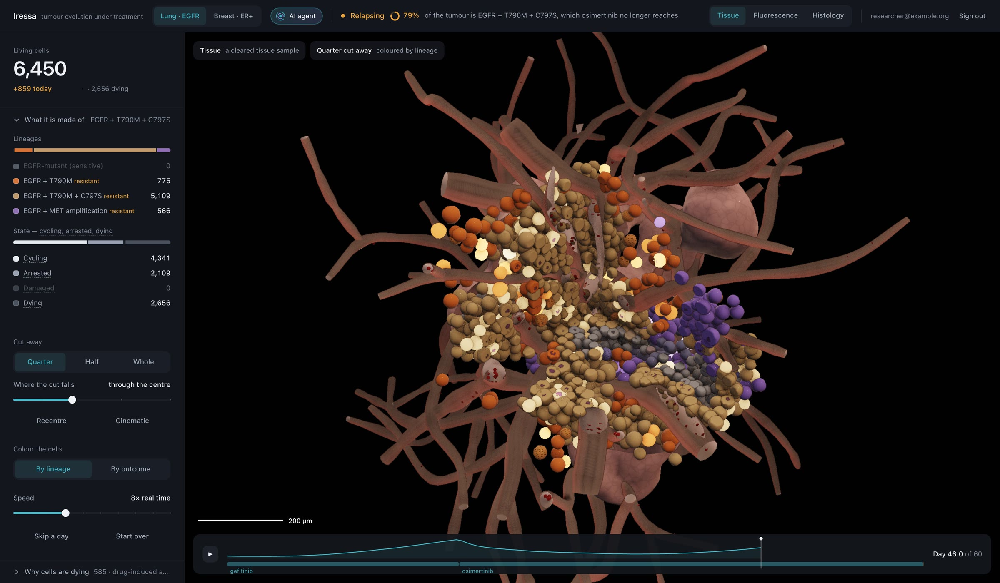

### See it three ways

The same cells, drawn the way three different lab techniques would show them.
Press <kbd>1</kbd>, <kbd>2</kbd> or <kbd>3</kbd> to switch.

<table>
<tr>
<td width="33%">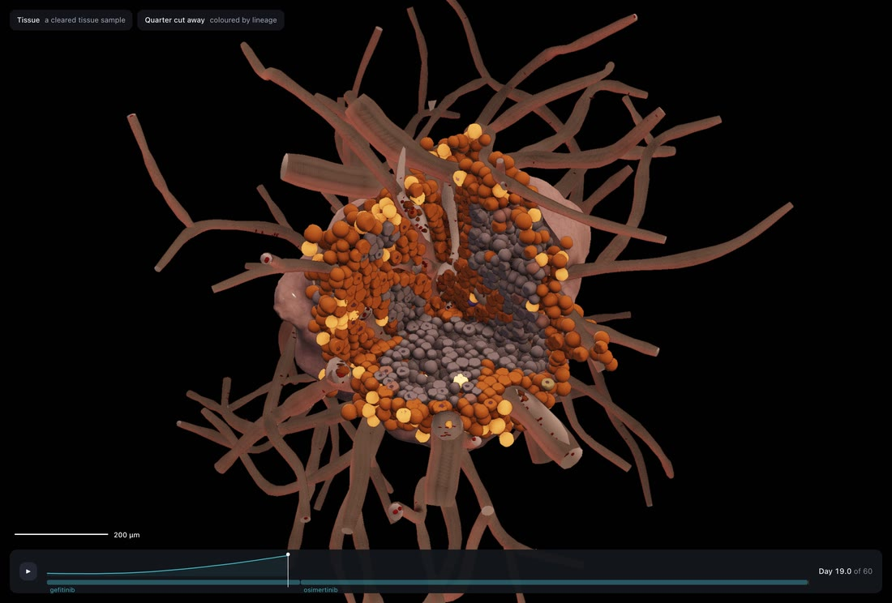</td>
<td width="33%">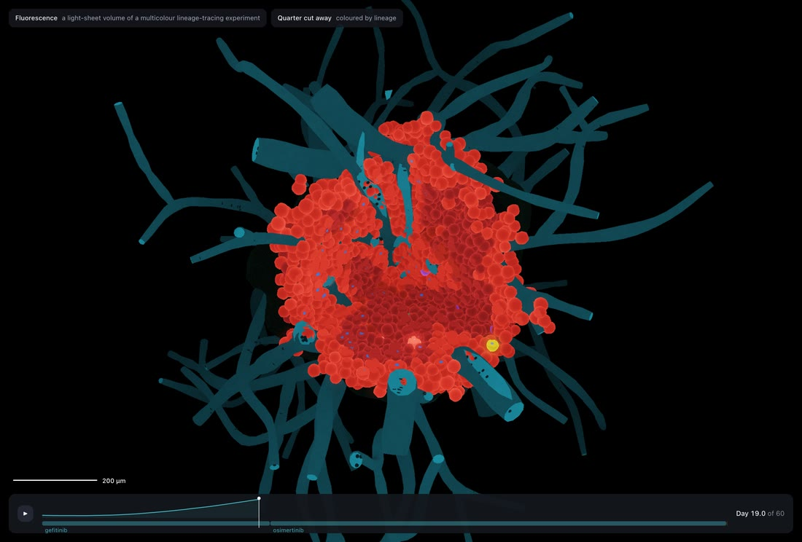</td>
<td width="33%">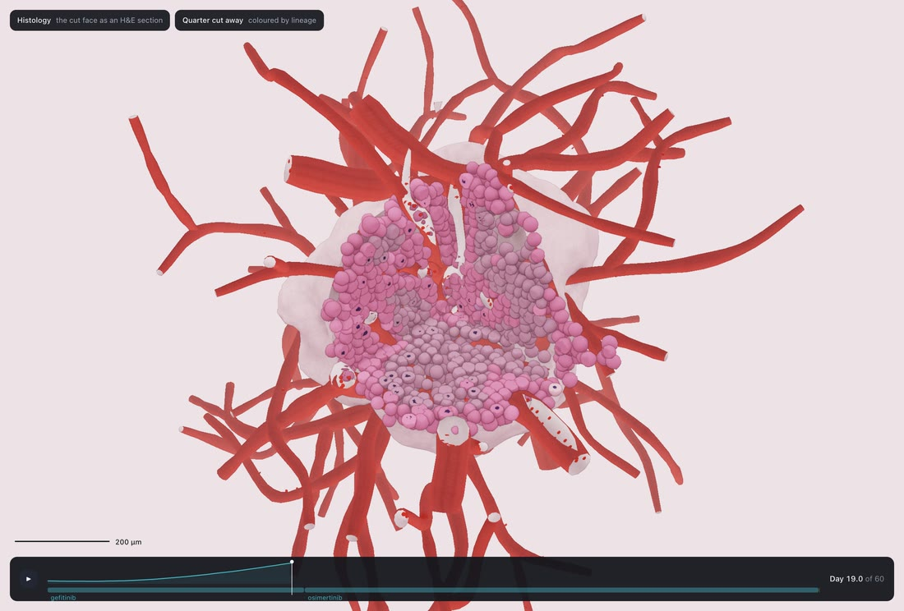</td>
</tr>
<tr>
<td valign="top"><b>Tissue</b><br>A cleared sample: packed cells, membranes, nuclei, and necrosis deep inside.</td>
<td valign="top"><b>Fluorescence</b><br>A lineage-tracing experiment: every clone glows in its own colour.</td>
<td valign="top"><b>Histology</b><br>An H&amp;E section: pink cytoplasm, purple nuclei, red cells in the vessels.</td>
</tr>
</table>

### Ask any cell what happened to it

<table>
<tr>
<td width="50%">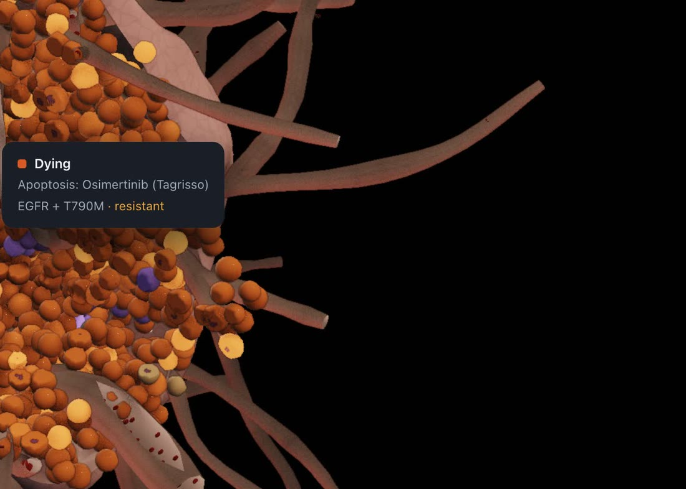</td>
<td width="50%">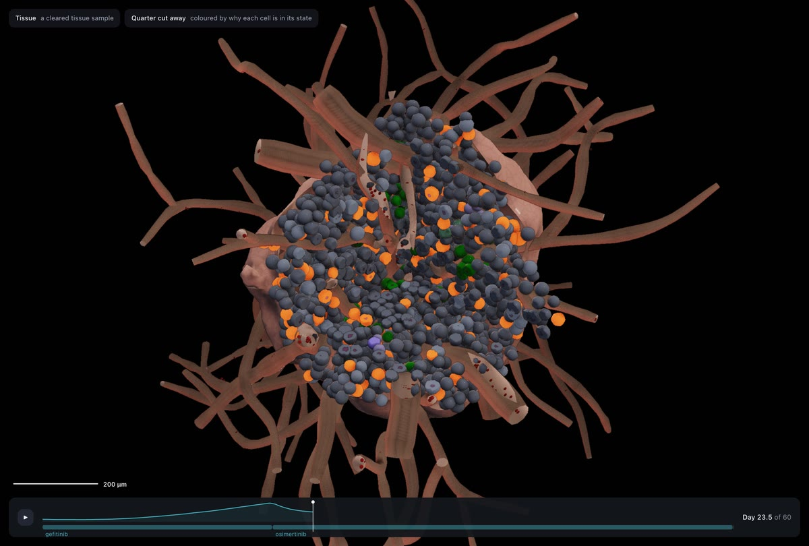</td>
</tr>
<tr>
<td valign="top"><b>Hover a cell</b> for its state, its lineage and the cause behind it: <i>"Apoptosis: Osimertinib"</i>, <i>"Necrosis: hypoxia"</i>.</td>
<td valign="top"><b>Colour by outcome</b> to tint every cell by why it is in its current state. Here, four days after the switch to osimertinib.</td>
</tr>
</table>

Cut a quarter or a half away and slide the cut through the mass. The cut faces
are individual cells; the rest of the tumour is a smooth surface.

### Read the evidence and run your own experiment

<table>
<tr>
<td width="25%">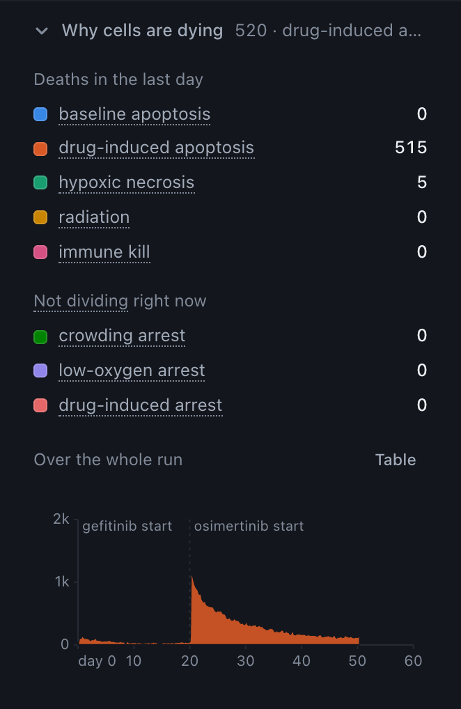</td>
<td width="25%">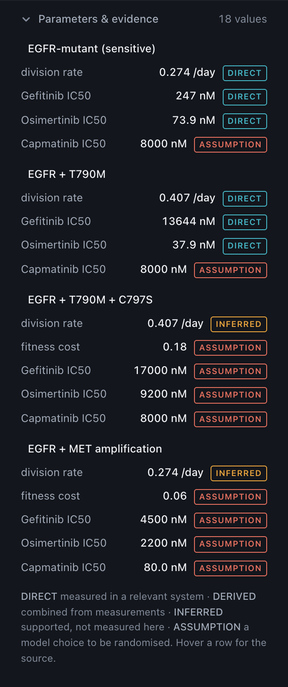</td>
<td width="25%">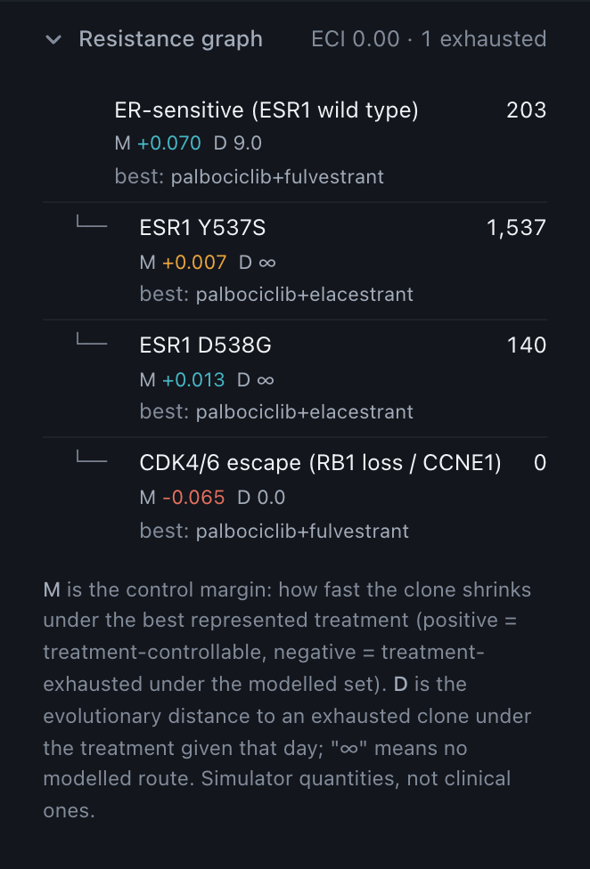</td>
<td width="25%">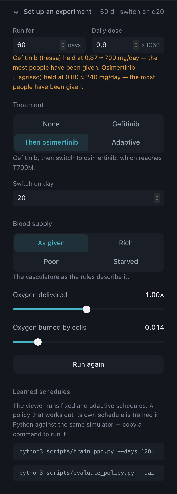</td>
</tr>
<tr>
<td valign="top"><b>Why cells are dying</b><br>Deaths by cause, last day and whole run, with treatment changes marked.</td>
<td valign="top"><b>Parameters &amp; evidence</b><br>Every value labelled as measured, inferred or assumed.</td>
<td valign="top"><b>Resistance graph</b><br>Which clones the represented drugs can still control.</td>
<td valign="top"><b>Set up an experiment</b><br>Change the dose, schedule or blood supply and run again.</td>
</tr>
</table>

### Two cancers, one engine

The physics knows only clones, transitions, drugs and exposures. Each cancer
is a single JSON file in [cancer_sim/cancers/](cancer_sim/cancers/), and the
top bar switches between them.

| | Lung · EGFR | Breast · ER+ |
|---|---|---|
| Disease | EGFR-mutant lung adenocarcinoma | ER+/HER2− breast cancer |
| Clones | EGFR, T790M, C797S, MET amplification | ESR1 wild type, ESR1 Y537S, ESR1 D538G, CDK4/6 escape |
| Treatments | gefitinib, osimertinib, capmatinib | endocrine suppression, palbociclib, fulvestrant, elacestrant |
| Open with | [`/simulation/`](https://iressa.quicx.dev/simulation/) | [`/simulation/?cancer=breast_er_her2neg`](https://iressa.quicx.dev/simulation/?cancer=breast_er_her2neg) |

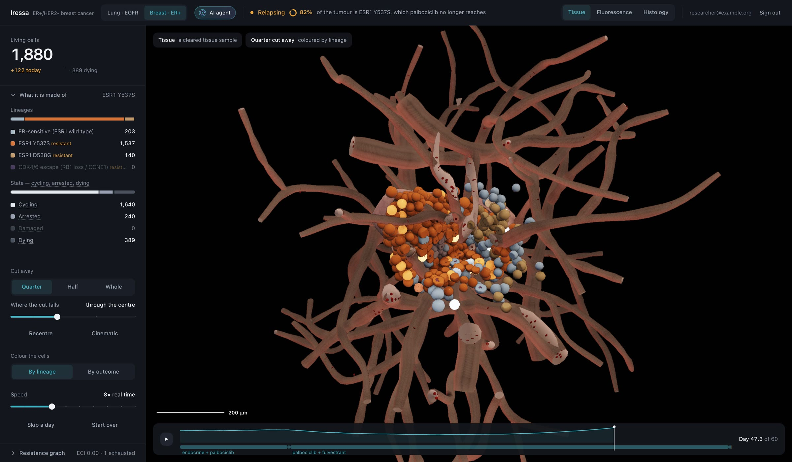

### Watch an AI agent learn a treatment pattern

Press **AI agent**, give it 15 to 60 seconds, and a small REINFORCE agent
practises on hundreds of simulated tumours of the cancer on screen, choosing a
regimen every 10 days. While it learns, the 3D view plays its latest practice
run and the panel draws its "brain": what it looks at, what it now prefers,
and its learning curve. At the end it plays the learned pattern on a tumour it
never practised on and ranks it against fixed strategies on held-out seeds.

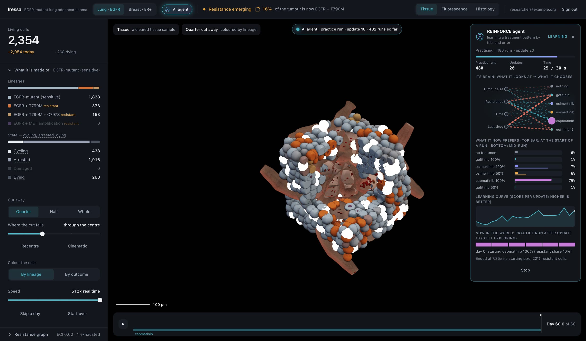

The policy is a linear softmax over a handful of readable features, written in
plain numpy ([cancer_sim/reinforce.py](cancer_sim/reinforce.py)), so its
weights can be read rather than guessed at. A half-minute of practice is a
demonstration of learning, and its result is often a poor schedule. A heavier
PPO pipeline with domain randomisation lives in
[scripts/train_ppo.py](scripts/train_ppo.py); see
[docs/rl-treatment-design.md](docs/rl-treatment-design.md).

> [!IMPORTANT]
> A learned pattern is whatever keeps *this model's* simulated tumour
> controlled with *its* represented drugs. It is not treatment advice.

## Quick start

To run your own copy you need Node 20+ and Python 3.10+.

```bash
git clone https://github.com/SborJ/Iressa.git
cd Iressa
cp .env.example .env.local    # then add your Supabase URL and anon key
npm start                     # installs what is missing, then serves http://localhost:5173
```

`npm start` installs the Node packages, creates the Python environment the AI
agent needs, and starts the server. The landing page is at `/` and the
simulator at `/simulation/`.

The simulator asks researchers to sign in, so it needs a Supabase project
before it will open: [docs/research-access.md](docs/research-access.md) walks
through it, including ORCID sign-in. The landing page is public.

To work on the Python engine and run its tests:

```bash
.venv/bin/pip install -r requirements-dev.txt

# simulate a tumour and export it for the 3D viewer
.venv/bin/python scripts/export_iressa_run.py --name demo48 --schedule gefitinib-osimertinib --size 48 --days 60

# train the AI agent from a terminal
.venv/bin/python scripts/train_reinforce.py --cancer lung_egfr --seconds 45
```

| Command | What it does |
|---|---|
| `npm start` | Set up anything missing (Node packages, the Python `.venv`), then start the server |
| `npm run dev` | Start the server only, when everything is already installed |
| `npm test` | 91 viewer tests |
| `npm run build` | Typecheck and production build |
| `npm run sim` | The TypeScript stand-in simulator, headless, with a cause breakdown |
| `npm run record` | Write `run.events` and `run.keyframes` for replay |
| `.venv/bin/python -m pytest -q` | 141 engine, calibration and export tests |

<details>
<summary><b>Keyboard shortcuts and URL parameters</b></summary>

| Key | Action |
|---|---|
| <kbd>Space</kbd> | Play or pause |
| <kbd>.</kbd> | Step |
| <kbd>1</kbd> <kbd>2</kbd> <kbd>3</kbd> | Tissue, Fluorescence, Histology |
| <kbd>F</kbd> | Frame the tumour |
| <kbd>R</kbd> | Start the run over |

| URL | Opens |
|---|---|
| `/` | The landing page |
| `/simulation/` | The lung model's recorded run |
| `/simulation/?cancer=breast_er_her2neg` | The breast model's recorded run |
| `/simulation/?cancer=breast_er_her2neg&run=breast48-ppo` | The same tumour treated by a trained PPO policy |
| `/simulation/?source=local` | The TypeScript stand-in simulator, live |
| `/simulation/?source=file&rules=…&events=…&keyframes=…` | Any recorded run |
| `/simulation/?source=socket&host=…&port=…` | A run streamed over a WebSocket |

</details>

## Deploying

### How the live site is hosted

[iressa.quicx.dev](https://iressa.quicx.dev/) is self-hosted. It runs on our
own Ubuntu (Debian-based) server, published through a
[Cloudflare Tunnel](https://developers.cloudflare.com/cloudflare-one/connections/connect-networks/):

```
visitor ──HTTPS──▶ Cloudflare ──encrypted tunnel──▶ our server ──▶ npm start (localhost:5173)
```

That setup is what keeps it secure:

- **No open ports.** The server makes an outbound connection to Cloudflare and
  accepts no inbound traffic. The app listens on `localhost` only, so it cannot
  be reached except through the tunnel.
- **HTTPS everywhere.** Cloudflare terminates TLS for the domain and the tunnel
  to the server is encrypted, so nothing travels in the clear.
- **The server's address stays private.** Visitors only ever see Cloudflare,
  which also absorbs denial-of-service traffic before it reaches the machine.
- **No passwords on the server.** Sign-in is handled by Supabase Auth; the
  server stores no credentials, and researcher profiles sit behind row level
  security.
- **Only the expected hostname is served.** Requests for any other host are
  rejected (`server.allowedHosts`).

### Hosting your own

1. On the server: clone the repository, add `.env.local`, run `npm start`.
   On Debian or Ubuntu, install `python3-venv` first; the script names the
   exact package if it is missing.
2. Add your domain to `server.allowedHosts` in [vite.config.ts](vite.config.ts),
   or the server answers "Blocked request".
3. Point your tunnel or reverse proxy at `http://localhost:5173`.
4. In Supabase, set the Site URL and Redirect URLs to your domain
   ([docs/research-access.md](docs/research-access.md)).

To update a running site: `git pull`, then `npm start` again.

> [!NOTE]
> The AI agent needs the Node server, because pressing **Start learning** runs
> a Python trainer on the host. A static build (`npm run build`, then serve
> `dist/`) hosts everything else, with the AI agent button inactive. On a
> public server, anyone can start a training run; only one runs at a time and
> each is capped at two minutes.

## How it works

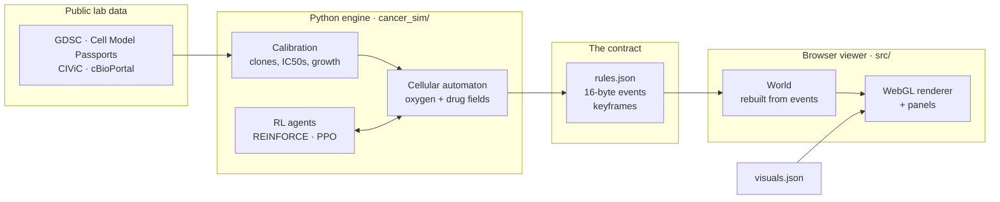

**The engine** ([cancer_sim/](cancer_sim/)) is a 3D cellular automaton, one
cell per voxel. Blood vessels supply oxygen and drug, which diffuse through
the tissue and are consumed along the way. Each cell reads its local oxygen
and drug level, then cycles, arrests, dies or divides, and each division is a
chance to mutate into the next clone on the resistance graph.

**The contract** ([docs/format.md](docs/format.md)) is deliberately tiny: a
`rules.json`, a stream of 16-byte event records (divide, die, mutate, change
state, each with its cause) and periodic keyframes. The Python and TypeScript
implementations are tested against each other byte for byte.

**The viewer** ([src/](src/)) knows no biology. It rebuilds the tissue from
the event stream and reads what a cause means from `rules.json` and how it
looks from `visuals.json`. There is not a rate, a threshold or a probability
anywhere in the renderer. The whole scene is five draw calls: only the cells
the cut exposes are drawn individually, and the rest is an isosurface.

That split is the point of the project. Change a number in a data file and the
behaviour changes, with no code edits and no rebuild. Adding a new cause of
death takes [a JSON edit and nothing else](docs/adding-a-cause.md).

## Code map

Where everything lives and what each file is for. The project has two halves
that only meet through a file format: a **Python engine** that decides what
happens to each cell, and a **browser viewer** that draws it.

```
Iressa/
├── index.html            the landing page
├── simulation/           the simulator page
├── src/                  the browser viewer (TypeScript)
├── cancer_sim/           the simulation engine (Python)
├── data/                 rules, colours, datasets and recorded runs
├── scripts/              command-line tools
├── tests/                viewer and engine tests
├── docs/                 documentation
└── supabase/             the accounts database
```

### The pages

| File | What it is |
|---|---|
| [index.html](index.html) | The public landing page, in one self-contained file: its styles, the hero video player and the scroll-driven "how resistance happens" section |
| [landing/media/](landing/media/) | The landing page's video and images |
| [simulation/index.html](simulation/index.html) | The simulator's page: layout, styles and the loading screen. Everything interactive is loaded from `src/` |
| [vite.config.ts](vite.config.ts) | The dev server: page routes, the allowed hostname, and the `/api/ai/*` endpoints that start the Python trainer for the AI agent |

### The viewer: `src/`

It draws a run and knows no biology. Every number it shows comes from the data files or the event stream.

| File | What it does |
|---|---|
| [src/main.ts](src/main.ts) | The entry point: checks sign-in, loads the data, picks where the run comes from, and wires the renderer, panels and controls together |
| [src/data.ts](src/data.ts) | Fetches `rules.json` and `visuals.json` at startup and validates them against their schemas |
| [src/defaultRun.ts](src/defaultRun.ts) | Which recorded run opens for each cancer |
| [src/doseLimits.ts](src/doseLimits.ts) | The highest exposure of each drug the experiment controls will allow |
| [src/experimentParams.ts](src/experimentParams.ts) | Turns the "Set up an experiment" choices into a run |
| **`src/format/`** | **The file format, shared with Python** |
| [events.ts](src/format/events.ts) | The 16-byte event record: divide, die, mutate, change state |
| [keyframes.ts](src/format/keyframes.ts) | Full snapshots of the tissue, so the viewer can jump in time |
| **`src/source/`** | **Where a run comes from** |
| [types.ts](src/source/types.ts) | The one interface the renderer talks to |
| [fileSource.ts](src/source/fileSource.ts) | Replays a recorded run |
| [socketSource.ts](src/source/socketSource.ts) | Receives a run streamed over a WebSocket |
| [localSim.ts](src/source/localSim.ts) | Runs the TypeScript stand-in simulator in the browser |
| **`src/world/`** | **The tissue, as the viewer holds it** |
| [world.ts](src/world/world.ts) | Rebuilds the state of every cell purely from the event stream |
| [causeStats.ts](src/world/causeStats.ts) | Tallies deaths and arrests by cause over time |
| **`src/render/`** | **The 3D drawing (three.js, WebGL2)** |
| [viewer.ts](src/render/viewer.ts) | The scene, camera, the cut, picking the cell under the pointer, and the frame loop |
| [cellMesh.ts](src/render/cellMesh.ts) | The individual cells on the cut faces, drawn as instances |
| [isosurface.ts](src/render/isosurface.ts), [surfaceMesh.ts](src/render/surfaceMesh.ts) | The smooth outer surface of the tumour where single cells are not drawn |
| [vesselMesh.ts](src/render/vesselMesh.ts) | Blood vessels and the red cells inside them |
| [visuals.ts](src/render/visuals.ts) | Reads `visuals.json` into colours and animation presets |
| [shaders/](src/render/shaders/) | The GLSL for cells, surface, vessels and the final image, shared by the three imaging views |
| **`src/ui/`** | **Everything around the 3D view** |
| [panel.ts](src/ui/panel.ts) | The side panel: lineages, states, resistance graph, parameters and evidence |
| [controls.ts](src/ui/controls.ts), [shortcuts.ts](src/ui/shortcuts.ts) | Play, speed, view, cut and colour controls, and their keys |
| [timeline.ts](src/ui/timeline.ts) | The scrubber with the treatment schedule under it |
| [card.ts](src/ui/card.ts) | The hover card that says why a cell is in its state |
| [headline.ts](src/ui/headline.ts), [narrative.ts](src/ui/narrative.ts) | The plain-language status line in the top bar |
| [causeChart.ts](src/ui/causeChart.ts) | The deaths-by-cause chart |
| [experiment.ts](src/ui/experiment.ts) | The "Set up an experiment" form |
| [aiAgent.ts](src/ui/aiAgent.ts) | The AI agent panel: training progress, its "brain" diagram, preferences and learning curve |
| [runMetrics.ts](src/ui/runMetrics.ts) | Reads the controllability readings a recorded run carries |
| [labels.ts](src/ui/labels.ts) | All wording about causes and states, taken from `rules.json` |
| **`src/sim/`** | **The stand-in simulator (for development; `?source=local`)** |
| [simulator.ts](src/sim/simulator.ts) | A TypeScript simulator that produces the same events as the engine |
| [rules.ts](src/sim/rules.ts) | Parses `rules.json` into typed rules |
| [fields.ts](src/sim/fields.ts), [grid.ts](src/sim/grid.ts), [vasculature.ts](src/sim/vasculature.ts), [rng.ts](src/sim/rng.ts) | Oxygen and drug fields, the voxel lattice, the vessel tree and reproducible random numbers |
| **`src/auth/`** | **Sign-in** |
| [authService.ts](src/auth/authService.ts) | The only module that talks to Supabase: sign in, register, reset, ORCID |
| [authView.ts](src/auth/authView.ts) | The sign-in, register and password screens |
| [supabase.ts](src/auth/supabase.ts) | Creates the Supabase client from the `.env.local` keys and refuses secret keys |

### The engine: `cancer_sim/`

It decides what happens to each cell and writes it out in the viewer's format.

| File | What it does |
|---|---|
| [cancers/lung_egfr.json](cancer_sim/cancers/lung_egfr.json), [cancers/breast_er_her2neg.json](cancer_sim/cancers/breast_er_her2neg.json) | One file per cancer: its clones, mutations, drugs, schedules and the AI agent's choices |
| [world.py](cancer_sim/world.py), [world_seed.py](cancer_sim/world_seed.py) | The lattice of cells and vessels, and how the starting tumour is seeded |
| [vasculature.py](cancer_sim/vasculature.py) | Grows the 3D blood-vessel tree |
| [fields.py](cancer_sim/fields.py) | Solves how oxygen and drug spread from the vessels through the tissue |
| [automata.py](cancer_sim/automata.py) | The core rules, one step at a time: fields, cell states, death, clearance, division and mutation |
| [mutation_flow.py](cancer_sim/mutation_flow.py) | Which clone can mutate into which |
| [simulation.py](cancer_sim/simulation.py) | Treatment schedules (none, continuous, switch, adaptive) and the runner that steps the tumour through them |
| [experiments.py](cancer_sim/experiments.py) | Runs one configuration or a panel of them and computes the outcome metrics |
| [controllability.py](cancer_sim/controllability.py) | Measures how controllable the tumour still is with the drugs available |
| [iressa_export.py](cancer_sim/iressa_export.py) | Writes a run as `rules.json`, events and keyframes for the viewer |
| [reinforce.py](cancer_sim/reinforce.py) | The lightweight REINFORCE agent behind the AI agent button (numpy only) |
| [rl_env.py](cancer_sim/rl_env.py), [rl_eval.py](cancer_sim/rl_eval.py) | The Gymnasium environment for PPO, and evaluation on held-out tumours |
| [narration.py](cancer_sim/narration.py) | Plain-language descriptions of the agent's decisions |
| [live.py](cancer_sim/live.py) | A live two-way session that streams a running simulation to the viewer |
| [provenance.py](cancer_sim/provenance.py) | The source and unit of every parameter |
| [calibration/](cancer_sim/calibration/) | Turns the public datasets into clone parameters: [ingest/](cancer_sim/calibration/ingest/) reads GDSC, Cell Model Passports, CIViC and cBioPortal; [clones.py](cancer_sim/calibration/clones.py) matches cell lines and derives growth and drug response; [pipeline.py](cancer_sim/calibration/pipeline.py) runs it end to end; [report.py](cancer_sim/calibration/report.py) writes the calibration report |
| `*_viz.py` | Matplotlib and terminal plots for working without the 3D viewer |
| [python/iressa_format.py](python/iressa_format.py) | The Python side of the event format, tested byte for byte against the TypeScript one |

### The data: `data/`

| Path | What it holds |
|---|---|
| [rules.json](data/rules.json) | Every rate, threshold, probability and schedule for the stand-in simulator |
| [visuals.json](data/visuals.json) | Every colour, animation preset and duration |
| [schema/](data/schema/) | The JSON schemas both files are checked against at startup |
| [raw/](data/raw/) | The public datasets as downloaded, with checksums |
| [curated/](data/curated/), [config/](data/config/) | Hand-written clone definitions and physical constants |
| [processed/](data/processed/) | The calibrated parameters the engine runs on, and the calibration report |
| [runs/](data/runs/) | Recorded runs the viewer opens: `demo48` (lung), `breast48`, `breast48-ppo` |

### Scripts: `scripts/`

| Script | What it does |
|---|---|
| [start.sh](scripts/start.sh) | `npm start`: installs what is missing, then starts the server |
| [export_iressa_run.py](scripts/export_iressa_run.py) | Simulates a tumour and records it for the viewer |
| [train_reinforce.py](scripts/train_reinforce.py) | Trains the AI agent; the server runs this when you press **Start learning** |
| [train_ppo.py](scripts/train_ppo.py), [evaluate_policy.py](scripts/evaluate_policy.py) | Trains the deeper PPO policy and compares policies on held-out tumours |
| [prepare_data.py](scripts/prepare_data.py), [fetch_raw_data.py](scripts/fetch_raw_data.py), [audit_raw_data.py](scripts/audit_raw_data.py) | Download, check and calibrate the public data |
| [run_validation_suite.py](scripts/run_validation_suite.py), [render_validation_report.py](scripts/render_validation_report.py) | Run the validation experiments and write the validation report |
| [run_experiment_panel.py](scripts/run_experiment_panel.py), [run_repeated_experiments.py](scripts/run_repeated_experiments.py), [run_sensitivity_panel.py](scripts/run_sensitivity_panel.py) | Compare treatment schedules, repeat them over many seeds, and test sensitivity to assumptions |
| [run_breast_experiment.py](scripts/run_breast_experiment.py), [run_ablations.py](scripts/run_ablations.py) | The breast-cancer strategy comparison and its ablations |
| [engine_freeze.py](scripts/engine_freeze.py) | Records or verifies the checksums of the validated engine files |
| [serve_live.py](scripts/serve_live.py) | Streams a live simulation to the viewer over a WebSocket |
| [run-sim.ts](scripts/run-sim.ts), [record-run.ts](scripts/record-run.ts) | Run and record the TypeScript stand-in simulator from the terminal |
| [setup-orcid-provider.mjs](scripts/setup-orcid-provider.mjs) | Registers ORCID as a sign-in provider in Supabase |

### Tests, docs and the rest

| Path | What it holds |
|---|---|
| [tests/](tests/) `*.test.ts` | Viewer tests: the format, the rules, the stand-in simulator, sources, dose limits |
| [tests/](tests/) `test_*.py` | Engine tests: automaton, field solvers, calibration, export, RL environment, scientific invariants |
| [docs/](docs/) | The documentation listed [below](#documentation), plus [images/](docs/images/) used in this README |
| [supabase/migrations/](supabase/migrations/) | The accounts database: researcher profiles, row level security, verified ORCID iDs |
| [.github/](.github/) | CI (typecheck, tests, build), issue and pull-request templates, Dependabot |
| [Business_plan.md](Business_plan.md) | The business plan |

## The science

Iressa is built to be checked. The numbers come from public datasets, every
parameter says where it came from, and the engine was audited before anything
was built on top of it.

| Source | Used for |
|---|---|
| [GDSC](https://www.cancerrxgene.org/) | Drug response: 242,036 dose-response rows, reduced to IC50s for matched cell lines |
| [Cell Model Passports](https://cellmodelpassports.sanger.ac.uk/) ([Sanger overview](https://www.sanger.ac.uk/tool/cell-model-passports-database/)) | Which cell lines carry which mutations, and how fast they grow |
| [CIViC](https://civicdb.org/) ([documentation](https://docs.civicdb.org/)) | Curated clinical evidence for each resistance mutation |
| [cBioPortal](https://www.cbioportal.org/) | How often each alteration occurs in a real patient cohort |

The studies below support the resistance mechanisms and treatment context
represented in the two models. They are distinct from the datasets used to
calibrate specific numeric parameters.

| Lung cancer research | What it supports |
|---|---|
| [Pao et al., *PLoS Medicine* (2005)](https://journals.plos.org/plosmedicine/article?id=10.1371/journal.pmed.0020073) | Acquired EGFR T790M resistance after gefitinib or erlotinib |
| [Kobayashi et al., *NEJM* (2005)](https://www.nejm.org/doi/full/10.1056/NEJMoa044238) | Independent evidence linking T790M to gefitinib resistance |
| [AURA3, *NEJM* (2017)](https://www.nejm.org/doi/full/10.1056/NEJMoa1612674) | Clinical activity of osimertinib after progression with T790M-positive disease |
| [Thress et al., *Nature Medicine* (2015)](https://www.nature.com/articles/nm.3854) | EGFR C797S as a mechanism of osimertinib resistance |
| [Piotrowska et al., *JCO* meeting abstract (2017)](https://ascopubs.org/doi/10.1200/JCO.2017.35.15_suppl.9020) | MET amplification as an observed osimertinib bypass-resistance mechanism |

| Breast cancer research | What it supports |
|---|---|
| [Toy et al., *Nature Genetics* (2013)](https://www.nature.com/articles/ng.2822) | Recurrent ESR1 ligand-binding-domain mutations in hormone-resistant disease |
| [Fanning et al., *eLife* (2016)](https://pmc.ncbi.nlm.nih.gov/articles/PMC4821807/) | Structural and cellular evidence for Y537S/D538G endocrine resistance |
| [Martin et al., *Nature Communications* (2017)](https://www.nature.com/articles/s41467-017-01864-y) | Naturally occurring Y537C/Y537S mutations in endocrine-resistant cell-line models |
| [Lin et al., *Clinical Cancer Research* (2025)](https://aacrjournals.org/clincancerres/article/31/9/1667/761236/ESR1-Y537S-and-D538G-Mutations-Drive-Resistance-to) | Evidence that Y537S/D538G can contribute to CDK4/6-inhibitor resistance |
| [EMERALD, *JCO* (2022)](https://ascopubs.org/doi/10.1200/JCO.22.00338) | Phase III elacestrant results, including the ESR1-mutant subgroup |

See [all model references](docs/references.md), including dataset publications.
These studies support model choices; they do not clinically validate the
simulator or its learned schedules.

**Provenance on every value.** Each parameter is tagged `DIRECT` (measured in
a relevant system), `DERIVED`, `INFERRED` or `ASSUMPTION`, in the data and in
the viewer's evidence panel. Gefitinib's IC50 against the sensitive clone is
measured across five cell lines; C797S's osimertinib resistance is supported
by the literature but its number is an assumption, and the interface says so.

**An audited engine.** The [validation report](docs/validation/VALIDATION_REPORT.md)
covers ingestion, calibration, units, both field solvers and multi-seed
behaviour over 20 seeds of 120 simulated days. It found and fixed real bugs,
including a drug field that never reached the cells and an unconverged oxygen
solver. The overall verdict is *pass with limitations*, and the limitations
are listed.

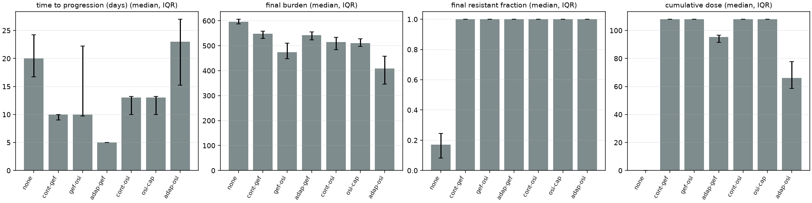

**Experiments, not anecdotes.** In the breast model, seven strategies were
compared over 120 days on five seeds. No fixed schedule prevented the ESR1
mutants from taking over; switching earlier only made the tumour smaller. The
[full table and discussion](docs/breast_er_positive.md) include the cases
where the learned policies did better, and the caveats that go with five seeds.

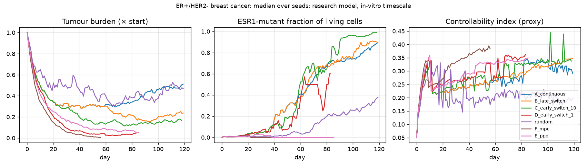

### What this is not

> [!WARNING]
> Iressa is a research and teaching model. It is not a clinical tool, and
> nothing it shows is a prediction for a patient.

- **Time runs fast.** Growth is calibrated on cell lines that double in 40 to
  100 hours, so events unfold 10 to 30 times faster than in a person.
- **Mutation rates are scaled up.** At real somatic rates no resistant clone
  would appear in a tumour of a few thousand simulated cells, so demo runs
  multiply the rate. The relapse you see is real in kind, not in timing.
- **Some drug responses are assumed.** Every MET-amplification and C797S IC50
  is an assumption, as is capmatinib's. They are labelled, not hidden.
- **Pharmacokinetics is simple.** The calibrated engine holds a constant drug
  concentration at the vessel wall.
- **The stand-in simulator's numbers are placeholders.** `data/rules.json`
  drives the TypeScript simulator used for development. Its structure is
  meant to last; several of its values were chosen so a 60-day run shows
  something, and its immune term is a flat surface hazard, not an immune model.

## Documentation

| Read this | To learn |
|---|---|
| [docs/format.md](docs/format.md) | The event format: the contract between any simulation and the renderer |
| [docs/adding-a-cause.md](docs/adding-a-cause.md) | How to add a cause of death or arrest without touching code |
| [docs/rendering.md](docs/rendering.md) | How the scene is drawn, and what is data versus illustration |
| [docs/physics_world.md](docs/physics_world.md) | The lattice, the fields and the cell rules |
| [docs/python-engine.md](docs/python-engine.md) | The engine's command reference |
| [docs/roadmap.md](docs/roadmap.md) | Known bottlenecks and what comes next |
| [docs/stand-in-simulator.md](docs/stand-in-simulator.md) | The TypeScript simulator, the source seam and how to read `rules.json` |
| [docs/breast_er_positive.md](docs/breast_er_positive.md) | The breast model, its evidence table and its experiments |
| [docs/rl-treatment-design.md](docs/rl-treatment-design.md) | The RL environment, rewards and PPO pipeline |
| [docs/validation/](docs/validation/) | The validation report, parameter provenance and viewer integration |
| [docs/research-access.md](docs/research-access.md) | Setting up sign-in with Supabase and ORCID |
| [docs/references.md](docs/references.md) | The papers and datasets behind the model |
| [Business_plan.md](Business_plan.md) | The commercial hypothesis, clinical and market research used, and evidence limits |

The [business plan](Business_plan.md) draws on the [FLAURA](https://www.nejm.org/doi/full/10.1056/NEJMoa1713137)
and [SERENA-6](https://www.nejm.org/doi/full/10.1056/NEJMoa2502929) trials,
[GLOBOCAN 2022 incidence](https://www.wcrf.org/preventing-cancer/cancer-statistics/worldwide-cancer-data/),
and linked biosimulation market reports. Its market sizing, prices and revenue
are estimates or hypotheses, not clinical validation or proven demand.

## Contributing

Issues and pull requests are welcome. [CONTRIBUTING.md](CONTRIBUTING.md) covers
setup, the tests to run and the one rule that matters most here: numbers
belong in data files with a provenance label, never in code. To report a
security problem, see [SECURITY.md](SECURITY.md).

## Citing

If Iressa is useful in your work, please cite it. GitHub's **Cite this
repository** button reads [CITATION.cff](CITATION.cff).

## License

[MIT](LICENSE). The public datasets under [data/raw/](data/raw/) remain under
their own providers' terms; see [docs/references.md](docs/references.md).

<sub>The project takes its name from gefitinib's brand name, the first drug in
the story it simulates. It is an independent research project and is not
affiliated with or endorsed by the drug's manufacturer.</sub>
