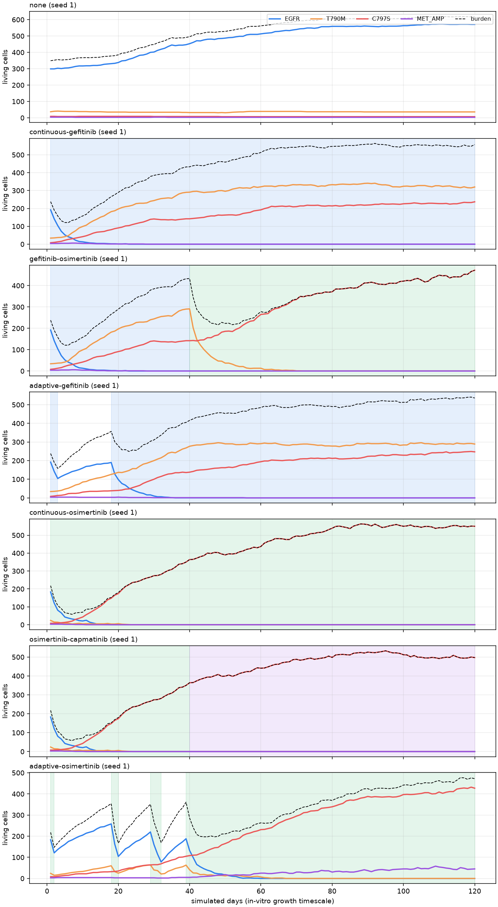

# Phase 1 Scientific Validation Report

EGFR-mutant lung cancer resistance simulator (`cancer_sim`), branch `engine-viewer-integration`
(validation work started on `sim-validation`; the engine was then generalised to 3D for the viewer,
see `VIEWER_INTEGRATION.md`; the 2D results below were regenerated with the final engine).
Validation suite: 20 seeds x 120.0 simulated days per run
(`scripts/run_validation_suite.py`, 17 min). Numbers below are read from `outputs/validation/`.

**Scope statement.** This is an educational/research simulator of treatment-driven clonal
selection. It is not a clinical treatment optimizer and nothing in this report is a prediction
for a patient. Simulated "days" run on in-vitro cell-line growth kinetics (doubling times of
40-100 h from Cell Model Passports), so events happen 10-30x faster than in patients.

## 0. Verdict

| subsystem | verdict | one-line reason |
| --- | --- | --- |
| Data ingestion (GDSC, CMP, CIViC, cBioPortal) | PASS | full files consumed; counts, hashes and units verified; two matching bugs fixed |
| Clone / model matching | PASS WITH LIMITATIONS | EGFR n=5 after a documented exclusion; T790M n=1; C797S and MET_AMP have no models |
| Drug calibration (IC50 -> death rate) | PASS WITH LIMITATIONS | LN_IC50 transform correct; k_max now derived from the assay definition; cytotoxic-only effect is an assumption |
| Growth calibration | PASS WITH LIMITATIONS | measured for EGFR/T790M (no double counting); inherited + assumed cost for C797S/MET_AMP |
| Units and timescales | PASS | unit table below; one hidden mismatch (drug decay per hour vs per day) and one dimensionless-D error fixed |
| Oxygen solver | PASS (after fix) | was unconverged (error up to 0.19); now converged to 1e-7 and checked against a dense reference |
| Drug solver | PASS (after fix) | legacy D was ~1e6x too small; physical quasi-steady solver validated against a dense reference |
| Biological sanity (untreated growth, selection) | PASS (after fixes) | untreated tumours grow; gefitinib selects T790M; osimertinib selects C797S/MET |
| Resistance succession | PASS | EGFR -> T790M -> C797S reproduced with treatment switching |
| Multi-seed statistics | PASS | 20 seeds; medians, IQR, SD, 95% intervals reported |
| Sensitivity analysis | PASS | vascular density, oxygen uptake and starting resistant fraction dominate; see ranking |
| Pharmacokinetics | PASS WITH LIMITATIONS | constant vessel concentration; no PK model (documented, not introduced) |
| Capmatinib / MET_AMP | PASS WITH LIMITATIONS | all MET_AMP drug responses are assumed; MET-amplified EGFR-wild-type lines exist in GDSC but were not used |
| **Overall** | **PASS WITH LIMITATIONS** | no unresolved FAIL; the engine is frozen for Phase 2 |

## 1. Repository architecture

```
data/raw/            public exports (GDSC2 8.5, Cell Model Passports, CIViC, cBioPortal MSK-IMPACT 2017)
data/curated/        egfr_resistance_seed.json: clone definitions, resistance graph, documented exclusions, assay definition
data/config/         physics_calibration.json: lattice spacing, D, decay, vessel concentrations
cancer_sim/calibration/   ingest/*.py -> schema.py -> clones.py (matching, growth, IC50, k_max) -> validation.py -> report.py -> pipeline.py
data/processed/      calibrated_clone_parameters.json, resistance_graph.json, physics_calibration.json, clone_model_matches.csv, calibration_report.md

cancer_sim/world.py        lattice, vessels (3 legacy points or a grid at an intercapillary spacing), ScalarField, Cell
cancer_sim/fields.py       converged red-black SOR quasi-steady solver (+ dense reference for tests)      [PROTECTED]
cancer_sim/automata.py     CellularAutomataPhysics: fields -> states -> death -> clearance -> division/mutation [PROTECTED]
cancer_sim/world_seed.py   seeded initial tumour + vessel layout                                           [PROTECTED]
cancer_sim/simulation.py   treatment schedules (none/continuous/switch/adaptive AT50) + SimulationRunner  [PROTECTED]
cancer_sim/experiments.py  ExperimentConfig, run_single_experiment, metrics
cancer_sim/provenance.py   parameter provenance + unit tables
cancer_sim/*_viz.py        matplotlib live dashboard, summary and metrics plots
scripts/                   CLI: prepare_data, run_simulation, watch_simulation, panels, sweeps, run_validation_suite, render_validation_report
tests/                     unit tests (engine, calibration, invariants, solver validation)
```

Layers: scientific core = calibration + `automata.py`/`fields.py`/`world*.py`; treatment layer =
`simulation.py`; experiment layer = `experiments.py` + scripts; visualization = `*_viz.py`. The
files marked PROTECTED plus `data/processed/*` and `data/curated/*` form the engine boundary for
Phase 2: UI code may only call `SimulationRunner`, `CellularAutomataPhysics.step`, read
`WorldPhysics` state and the processed data files.

Step order inside one biological step (`CellularAutomataPhysics.step`): solve oxygen (quasi-steady),
solve drug (quasi-steady), assign states from oxygen, apply hypoxic then drug death, clear dead
cells, divide proliferating cells into empty Moore neighbours with mutation on daughter creation,
age cells. `SimulationRunner.step` asks the schedule for an action at the start of the step
(`record.drug`) and records the state at the end (`record.time`).

## 2. Data integrity audit

| stage | rows | note |
| --- | --- | --- |
| GDSC2 raw fitted dose-response (release 8.5) | 242,036 | 969 models x 286 drugs; full file, not truncated |
| GDSC2 rows for gefitinib / erlotinib / osimertinib | 2,870 | all three target drugs present (capmatinib is not screened in GDSC2) |
| normalized drug_response.csv | 2,870 | LN_IC50 (ln uM) -> exp() x 1000 = IC50 in nM |
| Cell Model Passports EGFR/MET lung rows (normalized) | 20 | mutations_summary + cnv_summary filtered to lung EGFR L858R / exon19del / T790M / C797S and MET amplification |
| genotype-matched models | 9 | 6 with GDSC drug data and used; 1 excluded with a documented reason; 2 without GDSC data |
| final calibrated IC50 records | 18 | median per clone and drug, min/max retained |
| CIViC accepted evidence rows | 69 | 11 resistance, 58 sensitivity; levels A-D |
| cBioPortal MSK-IMPACT 2017 NSCLC EGFR/MET alteration rows | 777 | 536 samples; prevalence context only |

| file | sha256 |
| --- | --- |
| gdsc_drug_response | `b472905ea811c145...` |
| cell_model_passports_mutations | `743df2a5e1260531...` |
| civic_evidence | `c8393e5708835572...` |
| cbioportal_alterations | `901439d00f53aaac...` |

Units: GDSC `LN_IC50` is the natural log of IC50 in micromolar; the pipeline converts with
`exp(LN_IC50) * 1000` to nM (checked: HCC-827 gefitinib -2.736 -> 64.8 nM; NCI-H1975 gefitinib
2.613 -> 13,644 nM). No duplicate model-drug pairs exist among the target drugs. GDSC2 does not
screen capmatinib; it does screen savolitinib and crizotinib (MET inhibitors) but no
EGFR-mutant, MET-amplified line carries them, so capmatinib stays assumed. Drug names are matched
by canonical lower-case name with brand aliases. Model ids are Sanger `SIDM` ids shared by GDSC
and Cell Model Passports. CIViC rows carry evidence level and direction and are used only as
qualitative sensitivity / resistance / transition evidence, never as numbers. cBioPortal rows are
used only for prevalence context (57 of 536 MSK-IMPACT NSCLC EGFR/MET samples carry T790M, 0 carry
C797S, 40 carry MET amplification); they are not converted to per-division mutation probabilities.

## 3. Clone / model matching audit

| clone | model | name | histology | canonical alterations | gefitinib IC50 nM | osimertinib IC50 nM | growth /day | used | exclusion |
| --- | --- | --- | --- | --- | --- | --- | --- | --- | --- |
| EGFR | SIDM00046 | H3255 | NSCLC | EGFR_L858R | 645 | 80 | 0.173 | yes |  |
| EGFR | SIDM00237 | PC-14 | NSCLC | EGFR_EXON19DEL | 247 | 37 | 0.384 | yes |  |
| EGFR | SIDM00341 | LOU-NH91 | Squamous Cell Lung Carcinoma | EGFR_EXON19DEL | 4124 | 1341 | 0.280 | yes |  |
| EGFR | SIDM00361 | PC-3_[JPC-3] | NSCLC | EGFR_EXON19DEL | 171 | 74 | 0.274 | yes |  |
| EGFR | SIDM00745 | NCI-H1650 | NSCLC | EGFR_EXON19DEL | 16504 | 1504 | 0.203 | **no** | homozygous PTEN loss confers intrinsic EGFR-TKI resistance despite the EGFR exon 19 deleti... |
| EGFR | SIDM01067 | HCC-827 | NSCLC | EGFR_EXON19DEL | 65 | 28 | 0.252 | yes |  |
| EGFR | SIDM01596 | HCC4006 | NSCLC | EGFR_EXON19DEL | - | - | - | yes |  |
| T790M | SIDM00759 | NCI-H1975 | NSCLC | EGFR_L858R|EGFR_T790M | 13644 | 38 | 0.407 | yes |  |
| MET_AMP | SIDM01598 | HCC-2935 | NSCLC | EGFR_EXON19DEL|MET_AMP | - | - | - | yes |  |

Findings and corrections:

* **Missed exon 19 deletions (fixed).** The canonicaliser only recognised `E746...` deletions,
  so PC-3 [JPC-3] (`L747_E749delLRE`), HCC4006 (`L747_E749delLRE`) and LOU-NH91
  (`L747_P753delinsS`) were dropped. Exon 19 deletions cluster on codons 745-753 (Kobayashi &
  Mitsudomi, Cancer Sci 2016); the matcher now recognises any deletion touching that range.
  PC-3 and LOU-NH91 have GDSC data and enter the EGFR clone; HCC4006 is genotype-matched but has
  no GDSC2 drug data.
* **NCI-H1650 excluded (documented).** It carries the activating deletion but is intrinsically
  EGFR-TKI resistant through homozygous PTEN loss (Sos et al., Cancer Res 2009, PMID 19351834);
  GDSC2 agrees (gefitinib IC50 16.5 uM, AUC 0.93). It stays in the match table with
  `used_in_calibration = False` and the reason; it is never dropped silently.
* **LOU-NH91 is squamous.** It is kept because clones are defined by genotype, and its higher
  IC50 (4.1 uM) is visible in the reported range. Removing it would lower the EGFR gefitinib
  median from 247 to 209 nM.
* **T790M rests on one model** (NCI-H1975, L858R + T790M). n = 1 is stated everywhere.
* **C797S** has no public cell model; **MET_AMP** matches HCC-2935 (exon19del + MET amp) which has
  no GDSC drug data or doubling time. Both clones keep assumed drug responses.

## 4. Parameter provenance

| clone | parameter | value | unit | status | n | range |
| --- | --- | --- | --- | --- | --- | --- |
| EGFR | gefitinib IC50 | 247.3 | nM | measured | 5 | 64.8-4124.3 |
| EGFR | osimertinib IC50 | 73.9 | nM | measured | 5 | 27.6-1341.3 |
| EGFR | capmatinib IC50 | 8000.0 | nM | assumed | 0 | 8000.0-8000.0 |
| EGFR | growth rate | 0.274 | 1/day | measured | 5 | 0.173-0.384 |
| EGFR | fitness cost | 0.00 | fraction | not_applied |  |  |
| EGFR | k_max | 0.462 | 1/day | inferred |  |  |
| T790M | gefitinib IC50 | 13643.7 | nM | measured | 1 | 13643.7-13643.7 |
| T790M | osimertinib IC50 | 37.9 | nM | measured | 1 | 37.9-37.9 |
| T790M | capmatinib IC50 | 8000.0 | nM | assumed | 0 | 8000.0-8000.0 |
| T790M | growth rate | 0.407 | 1/day | measured | 1 | 0.407-0.407 |
| T790M | fitness cost | 0.00 | fraction | not_applied |  |  |
| T790M | k_max | 0.462 | 1/day | inferred |  |  |
| C797S | gefitinib IC50 | 17000.0 | nM | assumed | 0 | 17000.0-17000.0 |
| C797S | osimertinib IC50 | 9200.0 | nM | assumed | 0 | 9200.0-9200.0 |
| C797S | capmatinib IC50 | 8000.0 | nM | assumed | 0 | 8000.0-8000.0 |
| C797S | growth rate | 0.407 | 1/day | inferred | 1 | 0.407-0.407 |
| C797S | fitness cost | 0.18 | fraction | assumed |  |  |
| C797S | k_max | 0.462 | 1/day | inferred |  |  |
| MET_AMP | gefitinib IC50 | 4500.0 | nM | assumed | 0 | 4500.0-4500.0 |
| MET_AMP | osimertinib IC50 | 2200.0 | nM | assumed | 0 | 2200.0-2200.0 |
| MET_AMP | capmatinib IC50 | 80.0 | nM | assumed | 0 | 80.0-80.0 |
| MET_AMP | growth rate | 0.274 | 1/day | inferred | 5 | 0.173-0.384 |
| MET_AMP | fitness cost | 0.06 | fraction | assumed |  |  |
| MET_AMP | k_max | 0.462 | 1/day | inferred |  |  |

The complete table including physics, world and mutation parameters is in
`docs/validation/parameter_provenance.md` (generated by `cancer_sim/provenance.py`).

## 5. Unit table

| quantity | unit | where |
| --- | --- | --- |
| lattice spacing dx | um | AutomataConfig.lattice_spacing_um, WorldConfig.cell_size_um |
| biological time step dt | days | SimulationRunner.run(dt=...), AutomataConfig.necrosis_exposure_time |
| experiment horizon | days | --days |
| growth rate | 1/day | ClonePhenotype.growth_rate; P_div = 1 - exp(-r (1-c) dt) |
| max drug death rate k_max | 1/day | ClonePhenotype.max_drug_death_rate; P_death = 1 - exp(-k_max E(C) dt) |
| hypoxic death rate | 1/day | AutomataConfig.hypoxic_death_rate |
| dead-cell clearance rate | 1/day | AutomataConfig.necrotic_clearance_rate |
| drug concentration | nM | IC50 (GDSC LN_IC50 in ln uM -> exp()*1000 nM); local C = normalised field x vessel nM |
| drug diffusivity | um^2/s -> sites^2/day | AutomataConfig.drug_diffusion_um2_s -> drug_grid_diffusion_per_day |
| drug decay | 1/h -> 1/day | AutomataConfig.drug_decay_per_hour -> drug_decay_per_day |
| oxygen | fraction of vessel value (0-1) | ScalarField; thresholds are fractions |
| oxygen diffusion / uptake | dimensionless lattice coefficients | only their ratio (penetration depth) is physical |
| mutation probability | per successful division | resistance_graph.json x mutation_probability_scale |
| legacy explicit drug solver | sites^2/day (0.1), 1/day decay | drug_solver=explicit_legacy only; dimensionally inconsistent with the physics file |

## 6. Solver validation

| check | result |
| --- | --- |
| oxygen: converged SOR vs dense linear-algebra reference (default lattice, 30 vessels at 150 um) | max abs error 1.2e-06 after 157 sweeps; converged flag True |
| oxygen: legacy 80 Gauss-Seidel sweeps vs the same reference (30 vessels) | max abs error 0.06, mean 0.02 (on a 0-1 scale) -> **not converged** |
| oxygen: same comparison on the legacy world (3 point vessels) | converged: 4.9e-06 after 563 sweeps; legacy 80 sweeps: max abs error 0.21, mean 0.11 |
| oxygen penetration from a vessel (converged field) | falls below the proliferation threshold (0.22) at ~6 sites = 120 um and below necrosis (0.06) at ~8-9 sites = 160-180 um; consistent with the 100-200 um diffusion limit (Thomlinson & Gray 1955) |
| drug: physical quasi-steady field at dose 0.9 (D = 500 um^2/s, dx = 20 um, k = 0.02/h) | min 0.900, max 0.900; decay length 474 sites >> lattice, i.e. near-uniform at the vessel level |
| drug: legacy explicit solver after 10 days of dosing (D = 0.1 sites^2/day = 4.6e-4 um^2/s) | vessel site 1.00, 2 sites away 0.067, mean over lattice 0.0499 -> drug confined to ~2 sites around each vessel |
| drug: quasi-steady vs dense reference (12x9 lattice, test) | max abs error < 1e-6 (tests/test_physics_validation.py) |
| explicit stability check | legacy explicit solver kept its automatic sub-stepping (coefficient <= 0.2 per sub-step); not used by default |

Both solvers use the same five-point stencil and reflecting boundaries as before and iterate to
tolerance (red-black SOR, omega 1.7); the legacy explicit drug solver is retained as
`drug_solver="explicit_legacy"` for reproducibility of earlier outputs. Quasi-steady treatment of
drug is justified by timescale separation: diffusion across the 1 mm lattice takes ~30 min, drug
decay ~1.5 days, biological steps 0.25-1 day. Drug on/off transitions are therefore resolved to
within one biological step; no pharmacokinetic transients are modelled.

## 7. Biological sanity tests (20 seeds, 120 days)

| schedule | seeds | progression from nadir d, median [IQR] (rate) | regrowth to baseline d, median [IQR] (rate) | min burden | mean burden | final burden | final resistant fraction | resistant dominance d | cumulative dose | drug / hypoxic deaths | final T790M / C797S / MET |
| --- | --- | --- | --- | --- | --- | --- | --- | --- | --- | --- | --- |
| none | 20 | 20 [17-24] (100%) | 3 [3-3] (5%) | 356 [353-359] | 539 | 596 [588-606] | 0.17 [0.08-0.24] | - (n=0) | 0 | 0 / 294 | 78 / 6 / 4 |
| continuous-gefitinib | 20 | 10 [9-10] (100%) | 19 [17-20] (100%) | 124 [115-133] | 446 | 548 [530-558] | 1.00 [1.00-1.00] | 6 (n=20) | 108 | 1268 / 66 | 410 / 126 / 0 |
| gefitinib-osimertinib | 20 | 10 [10-22] (100%) | 19 [17-20] (100%) | 120 [113-130] | 310 | 474 [448-511] | 1.00 [1.00-1.00] | 6 (n=20) | 108 | 1881 / 42 | 0 / 462 / 7 |
| adaptive-gefitinib | 20 | 5 [5-5] (100%) | 9 [9-9] (100%) | 160 [158-166] | 421 | 543 [523-556] | 1.00 [1.00-1.00] | 19 (n=20) | 95 | 1366 / 64 | 371 / 104 / 8 |
| continuous-osimertinib | 20 | 13 [10-13] (100%) | 33 [29-43] (100%) | 58 [46-72] | 355 | 514 [484-533] | 1.00 [1.00-1.00] | 8 (n=20) | 108 | 1671 / 28 | 0 / 512 / 12 |
| osimertinib-capmatinib | 20 | 13 [10-13] (100%) | 33 [29-46] (100%) | 58 [46-72] | 358 | 510 [497-528] | 1.00 [1.00-1.00] | 8 (n=20) | 108 | 1680 / 22 | 0 / 510 / 0 |
| adaptive-osimertinib | 20 | 23 [15-27] (100%) | 7 [6-7] (100%) | 151 [146-155] | 278 | 408 [347-458] | 1.00 [1.00-1.00] | 42 (n=20) | 66 | 2254 / 39 | 0 / 386 / 42 |

95% intervals (2.5th-97.5th percentile across seeds):

| schedule | final burden 95% interval | resistant fraction 95% interval | time to progression 95% interval | final burden SD |
| --- | --- | --- | --- | --- |
| none | 564-661 | 0.03-0.33 | 13-29 | 25 |
| continuous-gefitinib | 496-577 | 1.00-1.00 | 9-12 | 24 |
| gefitinib-osimertinib | 382-545 | 1.00-1.00 | 9-61 | 46 |
| adaptive-gefitinib | 509-585 | 1.00-1.00 | 5-6 | 23 |
| continuous-osimertinib | 408-561 | 1.00-1.00 | 9-15 | 43 |
| osimertinib-capmatinib | 466-547 | 1.00-1.00 | 9-15 | 22 |
| adaptive-osimertinib | 228-507 | 0.99-1.00 | 4-44 | 86 |

Two progression definitions are reported. "Progression from nadir" is the first 20% regrowth
above the minimum burden; "regrowth to baseline" is the first return to the starting burden after
a response. **Neither is a fair comparator for the AT50 schedules**: the rule pauses the drug at
50% of baseline and restarts it at 100%, so both definitions are triggered by the rule itself
during the first holiday. For adaptive versus continuous comparisons use time to resistant
dominance, mean burden, final burden and cumulative dose.

Reading: untreated tumours grow until oxygen and space limit them (final burden is the lattice's
oxygenated carrying capacity; T790M rises from 8% to 17% without any drug because the H1975
doubling time is shorter than the sensitive lines'). Continuous gefitinib removes the EGFR clone
within ~2 weeks and T790M dominates by day 5; osimertinib-containing schedules remove T790M and
leave C797S (and some MET_AMP). Deaths under treatment are drug deaths, not hypoxic deaths (the
pre-fix engine showed the opposite). Adaptive gefitinib delays resistant dominance (19 vs 5 days)
with 11% less drug but reaches the same 120-day burden; adaptive osimertinib delays dominance
(36 vs 8 days), ends lower (441 vs 528) and uses 37% less drug, with wide seed-to-seed spread.
No schedule prevents eventual resistant regrowth, because in this calibration the resistant clone
has no fitness cost (it is measured to grow faster than the sensitive clone), so the premise of
containment-style adaptive therapy is weak here; this is a model result, not a clinical claim.




## 8. Resistance succession (seed 1, gefitinib -> osimertinib at day 40)

| day | active drug | burden | EGFR | T790M | C797S | MET_AMP | births | mutations | drug deaths | hypoxic deaths | debris |
| --- | --- | --- | --- | --- | --- | --- | --- | --- | --- | --- | --- |
| 1.0 | gefitinib | 238 | 192 | 34 | 8 | 4 | 7 | 0 | 105 | 14 | 100 |
| 10.0 | gefitinib | 158 | 13 | 99 | 42 | 4 | 21 | 0 | 12 | 0 | 64 |
| 20.0 | gefitinib | 290 | 1 | 197 | 91 | 1 | 18 | 0 | 5 | 0 | 18 |
| 30.0 | gefitinib | 385 | 0 | 244 | 141 | 0 | 12 | 0 | 6 | 0 | 23 |
| 40.0 | gefitinib | 433 | 0 | 291 | 142 | 0 | 13 | 0 | 8 | 4 | 27 |
| 41.0 | osimertinib | 345 | 0 | 202 | 143 | 0 | 16 | 0 | 104 | 0 | 100 |
| 50.0 | osimertinib | 223 | 0 | 37 | 186 | 0 | 19 | 0 | 24 | 0 | 103 |
| 60.0 | osimertinib | 278 | 0 | 13 | 265 | 0 | 22 | 0 | 9 | 0 | 54 |
| 90.0 | osimertinib | 413 | 0 | 0 | 413 | 0 | 11 | 0 | 10 | 0 | 31 |
| 120.0 | osimertinib | 472 | 0 | 0 | 472 | 0 | 18 | 0 | 12 | 0 | 35 |

## 9. Pre-existing resistance (T790M only, no mutation scaling, 20 seeds)

| initial resistant fraction | expected resistant cells (of 350) | schedule | seeds | time to progression median (reached) | time to resistant dominance (reached) | final resistant fraction | final burden | min burden |
| --- | --- | --- | --- | --- | --- | --- | --- | --- |
| 0% | 0.0 | continuous-gefitinib | 20 | 17 (1/20) | 16 (1/20) | 0.00 | 0 | 0 |
| 0% | 0.0 | adaptive-gefitinib | 20 | 53 (20/20) | 110 (2/20) | 0.00 | 229 | 138 |
| 0.01% | 0.0 | continuous-gefitinib | 20 | 17 (1/20) | 16 (1/20) | 0.00 | 0 | 0 |
| 0.01% | 0.0 | adaptive-gefitinib | 20 | 53 (20/20) | 110 (2/20) | 0.00 | 229 | 138 |
| 0.1% | 0.4 | continuous-gefitinib | 20 | 15 (5/20) | 15 (5/20) | 0.00 | 0 | 0 |
| 0.1% | 0.4 | adaptive-gefitinib | 20 | 40 (20/20) | 77 (3/20) | 0.00 | 261 | 136 |
| 1% | 3.5 | continuous-gefitinib | 20 | 14 (20/20) | 12 (20/20) | 1.00 | 544 | 50 |
| 1% | 3.5 | adaptive-gefitinib | 20 | 12 (20/20) | 76 (16/20) | 0.95 | 308 | 144 |
| 5% | 17.5 | continuous-gefitinib | 20 | 10 (20/20) | 7 (20/20) | 1.00 | 552 | 98 |
| 5% | 17.5 | adaptive-gefitinib | 20 | 5 (20/20) | 24 (20/20) | 1.00 | 540 | 151 |
| 8% | 28.0 | continuous-gefitinib | 20 | 10 (20/20) | 6 (20/20) | 1.00 | 558 | 116 |
| 8% | 28.0 | adaptive-gefitinib | 20 | 5 (20/20) | 21 (20/20) | 1.00 | 547 | 150 |

With 350 initial cells, fractions below ~0.3% mean zero resistant cells at start, so those rows
test acquired resistance at the base mutation rate (none appears). Resistance timing is
dominated by how many resistant cells exist at day 0.

## 10. Acquired resistance (no resistant cells at start)

| mutation scale | schedule | seeds | runs with >=1 resistant clone | mutations median | divisions median | final resistant fraction median |
| --- | --- | --- | --- | --- | --- | --- |
| x1 (p = 2.0e-05 per division for EGFR->T790M) | none | 20 | 1/20 | 0.0 | 551 | 0.00 |
| x1 (p = 2.0e-05 per division for EGFR->T790M) | continuous-gefitinib | 20 | 1/20 | 0.0 | 144 | 0.00 |
| x50 (p = 1.0e-03 per division for EGFR->T790M) | none | 20 | 16/20 | 1.0 | 556 | 0.00 |
| x50 (p = 1.0e-03 per division for EGFR->T790M) | continuous-gefitinib | 20 | 2/20 | 0.0 | 144 | 0.00 |
| x500 (p = 1.0e-02 per division for EGFR->T790M) | none | 20 | 20/20 | 8.0 | 562 | 0.13 |
| x500 (p = 1.0e-02 per division for EGFR->T790M) | continuous-gefitinib | 20 | 16/20 | 7.5 | 1204 | 1.00 |

Seeds 1-20 at the base rate produced 4 mutation events in 20 untreated runs where ~0.35 were expected; an independent replication with seeds 101-140 (40 runs, 22,676 divisions) produced 0 events against 0.68 expected, so the engine's per-division probability (measured directly as 3.05e-5 over 2e6 daughters) is as configured and the first block was a fluctuation.

At the base assumed rate (2e-5 per division for EGFR -> T790M) resistance essentially never
arises in a ~10^3-cell lattice over 120 days: the lattice performs ~10^3-10^4 divisions while a
clinical tumour performs ~10^9. The default `mutation_probability_scale = 50` is therefore a
documented demo inflation, labelled "assumed" in the provenance table; it is not a biological
estimate.

## 11. Horizon and time-step convergence

| horizon days | schedule | seeds | final burden | final resistant fraction | time to progression (reached) | cumulative dose |
| --- | --- | --- | --- | --- | --- | --- |
| 30 | none | 5 | 461 | 0.22 | 23 (5/5) | 0 |
| 30 | continuous-gefitinib | 5 | 398 | 1.00 | 9 (5/5) | 27 |
| 30 | gefitinib-osimertinib | 5 | 145 | 1.00 | 19 (4/5) | 27 |
| 30 | adaptive-gefitinib | 5 | 306 | 0.97 | 5 (5/5) | 14 |
| 60 | none | 5 | 590 | 0.23 | 23 (5/5) | 0 |
| 60 | continuous-gefitinib | 5 | 557 | 1.00 | 9 (5/5) | 54 |
| 60 | gefitinib-osimertinib | 5 | 216 | 1.00 | 10 (5/5) | 54 |
| 60 | adaptive-gefitinib | 5 | 483 | 1.00 | 5 (5/5) | 40 |
| 120 | none | 5 | 604 | 0.22 | 23 (5/5) | 0 |
| 120 | continuous-gefitinib | 5 | 554 | 1.00 | 9 (5/5) | 108 |
| 120 | gefitinib-osimertinib | 5 | 488 | 1.00 | 10 (5/5) | 108 |
| 120 | adaptive-gefitinib | 5 | 553 | 1.00 | 5 (5/5) | 94 |
| 240 | none | 5 | 603 | 0.22 | 23 (5/5) | 0 |
| 240 | continuous-gefitinib | 5 | 528 | 1.00 | 9 (5/5) | 216 |
| 240 | gefitinib-osimertinib | 5 | 521 | 1.00 | 10 (5/5) | 216 |
| 240 | adaptive-gefitinib | 5 | 546 | 1.00 | 5 (5/5) | 202 |

| dt (days) | schedule | final burden median [IQR] | min burden | births median | drug deaths median | resistant fraction |
| --- | --- | --- | --- | --- | --- | --- |
| 1.0 | none | 587 [564-598] | 355 | 478 | 0 | 0.18 |
| 1.0 | continuous-gefitinib | 536 [514-564] | 122 | 971 | 718 | 1.00 |
| 1.0 | gefitinib-osimertinib | 198 [157-279] | 118 | 1134 | 1252 | 1.00 |
| 0.5 | none | 575 [556-585] | 354 | 454 | 0 | 0.12 |
| 0.5 | continuous-gefitinib | 548 [530-552] | 133 | 984 | 746 | 1.00 |
| 0.5 | gefitinib-osimertinib | 232 [182-297] | 131 | 1298 | 1402 | 1.00 |
| 0.25 | none | 568 [556-574] | 351 | 454 | 0 | 0.16 |
| 0.25 | continuous-gefitinib | 542 [516-559] | 138 | 1025 | 806 | 1.00 |
| 0.25 | gefitinib-osimertinib | 226 [177-272] | 136 | 1454 | 1586 | 1.00 |

Division and death use rate-to-probability conversions (`1 - exp(-rate * dt)`), so halving dt
does not change expected rates; the residual dt dependence comes from within-step ordering
(death before division) and from daughters not dividing in their birth step. Conclusions do not
change qualitatively between dt = 1, 0.5 and 0.25 days.

## 12. Sensitivity analysis (5 seeds, 120 days, one factor at a time)

| schedule | final burden | resistant fraction | time to progression | C797S | MET_AMP |
| --- | --- | --- | --- | --- | --- |
| adaptive-gefitinib | 553 | 1.00 | 5 | 90 | 16 |
| continuous-gefitinib | 554 | 1.00 | 9 | 72 | 0 |
| gefitinib-osimertinib | 488 | 1.00 | 10 | 488 | 7 |

**One-factor changes (median over seeds; delta vs baseline in parentheses)**

| factor | level | schedule | final burden | resistant fraction | time to progression | C797S | MET_AMP |
| --- | --- | --- | --- | --- | --- | --- | --- |
| c797s_fitness_cost | 0.0 | adaptive-gefitinib | 537 (-16) | 1.00 (+0.00) | 5 (+0) | 115 (+25) | 5 (-11) |
| c797s_fitness_cost | 0.0 | continuous-gefitinib | 538 (-16) | 1.00 (+0.00) | 9 (+0) | 93 (+21) | 0 (+0) |
| c797s_fitness_cost | 0.0 | gefitinib-osimertinib | 474 (-14) | 1.00 (+0.00) | 10 (+0) | 465 (-23) | 0 (-7) |
| c797s_fitness_cost | 0.35 | adaptive-gefitinib | 518 (-35) | 1.00 (+0.00) | 5 (+0) | 96 (+6) | 36 (+20) |
| c797s_fitness_cost | 0.35 | continuous-gefitinib | 538 (-16) | 1.00 (+0.00) | 9 (+0) | 20 (-52) | 0 (+0) |
| c797s_fitness_cost | 0.35 | gefitinib-osimertinib | 423 (-65) | 1.00 (+0.00) | 57 (+47) | 423 (-65) | 0 (-7) |
| c797s_growth_scale | 0.5 | adaptive-gefitinib | 561 (+8) | 1.00 (+0.00) | 5 (+0) | 6 (-84) | 0 (-16) |
| c797s_growth_scale | 0.5 | continuous-gefitinib | 542 (-12) | 1.00 (+0.00) | 10 (+1) | 16 (-56) | 0 (+0) |
| c797s_growth_scale | 0.5 | gefitinib-osimertinib | 312 (-176) | 1.00 (+0.00) | 57 (+47) | 278 (-210) | 34 (+27) |
| c797s_growth_scale | 1.0 | adaptive-gefitinib | 553 (+0) | 1.00 (+0.00) | 5 (+0) | 90 (+0) | 16 (+0) |
| c797s_growth_scale | 1.0 | continuous-gefitinib | 554 (+0) | 1.00 (+0.00) | 9 (+0) | 72 (+0) | 0 (+0) |
| c797s_growth_scale | 1.0 | gefitinib-osimertinib | 488 (+0) | 1.00 (+0.00) | 10 (+0) | 488 (+0) | 7 (+0) |
| clone_weights | 75,18,4,3 | adaptive-gefitinib | 533 (-20) | 1.00 (+0.00) | 8 (+3) | 110 (+20) | 15 (-1) |
| clone_weights | 75,18,4,3 | continuous-gefitinib | 533 (-21) | 1.00 (+0.00) | 11 (+2) | 113 (+41) | 15 (+15) |
| clone_weights | 75,18,4,3 | gefitinib-osimertinib | 511 (+23) | 1.00 (+0.00) | 11 (+1) | 485 (-3) | 23 (+16) |
| clone_weights | 98,2,0,0 | adaptive-gefitinib | 474 (-79) | 1.00 (+0.00) | 19 (+14) | 1 (-89) | 0 (-16) |
| clone_weights | 98,2,0,0 | continuous-gefitinib | 536 (-18) | 1.00 (+0.00) | 12 (+3) | 5 (-67) | 0 (+0) |
| clone_weights | 98,2,0,0 | gefitinib-osimertinib | 246 (-242) | 1.00 (+0.00) | 60 (+50) | 246 (-242) | 0 (-7) |
| met_fitness_cost | 0.0 | adaptive-gefitinib | 543 (-10) | 1.00 (+0.00) | 5 (+0) | 121 (+31) | 1 (-15) |
| met_fitness_cost | 0.0 | continuous-gefitinib | 547 (-7) | 1.00 (+0.00) | 9 (+0) | 24 (-48) | 0 (+0) |
| met_fitness_cost | 0.0 | gefitinib-osimertinib | 472 (-16) | 1.00 (+0.00) | 55 (+45) | 472 (-16) | 0 (-7) |
| met_fitness_cost | 0.25 | adaptive-gefitinib | 532 (-21) | 1.00 (+0.00) | 5 (+0) | 113 (+23) | 8 (-8) |
| met_fitness_cost | 0.25 | continuous-gefitinib | 549 (-5) | 1.00 (+0.00) | 9 (+0) | 86 (+14) | 0 (+0) |
| met_fitness_cost | 0.25 | gefitinib-osimertinib | 450 (-38) | 1.00 (+0.00) | 10 (+0) | 450 (-38) | 0 (-7) |
| met_growth_scale | 0.5 | adaptive-gefitinib | 536 (-17) | 1.00 (+0.00) | 5 (+0) | 67 (-23) | 0 (-16) |
| met_growth_scale | 0.5 | continuous-gefitinib | 549 (-5) | 1.00 (+0.00) | 10 (+1) | 101 (+29) | 0 (+0) |
| met_growth_scale | 0.5 | gefitinib-osimertinib | 461 (-27) | 1.00 (+0.00) | 10 (+0) | 460 (-28) | 0 (-7) |
| met_growth_scale | 1.0 | adaptive-gefitinib | 553 (+0) | 1.00 (+0.00) | 5 (+0) | 90 (+0) | 16 (+0) |
| met_growth_scale | 1.0 | continuous-gefitinib | 554 (+0) | 1.00 (+0.00) | 9 (+0) | 72 (+0) | 0 (+0) |
| met_growth_scale | 1.0 | gefitinib-osimertinib | 488 (+0) | 1.00 (+0.00) | 10 (+0) | 488 (+0) | 7 (+0) |
| mutation_scale | 12.5 | adaptive-gefitinib | 536 (-17) | 1.00 (+0.00) | 5 (+0) | 96 (+6) | 16 (+0) |
| mutation_scale | 12.5 | continuous-gefitinib | 554 (+0) | 1.00 (+0.00) | 9 (+0) | 72 (+0) | 0 (+0) |
| mutation_scale | 12.5 | gefitinib-osimertinib | 486 (-2) | 1.00 (+0.00) | 10 (+0) | 485 (-3) | 1 (-6) |
| mutation_scale | 200.0 | adaptive-gefitinib | 524 (-29) | 1.00 (+0.00) | 5 (+0) | 158 (+68) | 1 (-15) |
| mutation_scale | 200.0 | continuous-gefitinib | 554 (+0) | 1.00 (+0.00) | 9 (+0) | 70 (-2) | 3 (+3) |
| mutation_scale | 200.0 | gefitinib-osimertinib | 472 (-16) | 1.00 (+0.00) | 10 (+0) | 457 (-31) | 25 (+18) |
| necrotic_clearance_rate | 0.0 | adaptive-gefitinib | 351 (-202) | 1.00 (+0.00) | 5 (+0) | 62 (-28) | 0 (-16) |
| necrotic_clearance_rate | 0.0 | continuous-gefitinib | 354 (-200) | 1.00 (+0.00) | 12 (+3) | 34 (-38) | 0 (+0) |
| necrotic_clearance_rate | 0.0 | gefitinib-osimertinib | 87 (-401) | 1.00 (+0.00) | 60 (+50) | 87 (-401) | 0 (-7) |
| necrotic_clearance_rate | 1.0 | adaptive-gefitinib | 559 (+6) | 1.00 (+0.00) | 5 (+0) | 138 (+48) | 18 (+2) |
| necrotic_clearance_rate | 1.0 | continuous-gefitinib | 547 (-7) | 1.00 (+0.00) | 9 (+0) | 34 (-38) | 0 (+0) |
| necrotic_clearance_rate | 1.0 | gefitinib-osimertinib | 456 (-32) | 1.00 (+0.00) | 58 (+48) | 438 (-50) | 36 (+29) |
| oxygen_mm_vmax | 0.02 | adaptive-gefitinib | 974 (+421) | 1.00 (+0.00) | 7 (+2) | 104 (+14) | 3 (-13) |
| oxygen_mm_vmax | 0.02 | continuous-gefitinib | 974 (+420) | 1.00 (+0.00) | 8 (-1) | 104 (+32) | 3 (+3) |
| oxygen_mm_vmax | 0.02 | gefitinib-osimertinib | 944 (+456) | 1.00 (+0.00) | 8 (-2) | 915 (+427) | 38 (+31) |
| oxygen_mm_vmax | 0.08 | adaptive-gefitinib | 206 (-347) | 0.39 (-0.61) | 10 (+5) | 15 (-75) | 2 (-14) |
| oxygen_mm_vmax | 0.08 | continuous-gefitinib | 214 (-340) | 1.00 (+0.00) | 13 (+4) | 42 (-30) | 2 (+2) |
| oxygen_mm_vmax | 0.08 | gefitinib-osimertinib | 106 (-382) | 1.00 (+0.00) | 54 (+44) | 106 (-382) | 0 (-7) |
| vessel_concentration_scale | 0.5 | adaptive-gefitinib | 575 (+22) | 1.00 (+0.00) | 6 (+1) | 35 (-55) | 14 (-2) |
| vessel_concentration_scale | 0.5 | continuous-gefitinib | 545 (-9) | 1.00 (+0.00) | 11 (+2) | 87 (+15) | 1 (+1) |
| vessel_concentration_scale | 0.5 | gefitinib-osimertinib | 483 (-5) | 1.00 (+0.00) | 12 (+2) | 483 (-5) | 31 (+24) |
| vessel_concentration_scale | 2.0 | adaptive-gefitinib | 519 (-34) | 1.00 (+0.00) | 6 (+1) | 65 (-25) | 0 (-16) |
| vessel_concentration_scale | 2.0 | continuous-gefitinib | 507 (-47) | 1.00 (+0.00) | 8 (-1) | 70 (-2) | 0 (+0) |
| vessel_concentration_scale | 2.0 | gefitinib-osimertinib | 389 (-99) | 1.00 (+0.00) | 9 (-1) | 389 (-99) | 0 (-7) |
| vessel_spacing_um | 100.0 | adaptive-gefitinib | 1580 (+1027) | 1.00 (+0.00) | 8 (+3) | 324 (+234) | 3 (-13) |
| vessel_spacing_um | 100.0 | continuous-gefitinib | 1580 (+1026) | 1.00 (+0.00) | 8 (-1) | 324 (+252) | 3 (+3) |
| vessel_spacing_um | 100.0 | gefitinib-osimertinib | 1507 (+1019) | 1.00 (+0.00) | 8 (-2) | 1507 (+1019) | 5 (-2) |
| vessel_spacing_um | 200.0 | adaptive-gefitinib | 303 (-250) | 0.26 (-0.74) | 6 (+1) | 18 (-72) | 9 (-7) |
| vessel_spacing_um | 200.0 | continuous-gefitinib | 295 (-259) | 1.00 (+0.00) | 11 (+2) | 74 (+2) | 0 (+0) |
| vessel_spacing_um | 200.0 | gefitinib-osimertinib | 270 (-218) | 1.00 (+0.00) | 12 (+2) | 270 (-218) | 0 (-7) |

**Ranking by largest effect**

| factor | max |delta final burden| | max |delta resistant fraction| | max |delta time to progression| (days) |
| --- | --- | --- | --- |
| vessel_spacing_um | 1027 | 0.74 | 3 |
| oxygen_mm_vmax | 456 | 0.61 | 44 |
| necrotic_clearance_rate | 401 | 0.00 | 50 |
| clone_weights | 242 | 0.00 | 50 |
| c797s_growth_scale | 176 | 0.00 | 47 |
| vessel_concentration_scale | 99 | 0.00 | 2 |
| c797s_fitness_cost | 65 | 0.00 | 47 |
| met_fitness_cost | 38 | 0.00 | 45 |
| mutation_scale | 29 | 0.00 | 0 |
| met_growth_scale | 27 | 0.00 | 1 |

Reading: outcomes are dominated by the microenvironment (vessel spacing and oxygen uptake set
the carrying capacity and therefore every burden metric), then by dead-cell clearance and by the
starting resistant fraction. The assumed C797S parameters matter for the osimertinib arm only.
Mutation scale and the MET_AMP parameters barely change 120-day outcomes because resistance is
pre-existing in the default experiments. Treatment-policy rankings (continuous vs adaptive) do
not flip under any single factor change tested; their magnitudes do.

## 13. Known assumptions

* Mutation probabilities per division (2e-5, 1e-5) and the x50 demo scale.
* Fitness costs of C797S (0.18) and MET_AMP (0.06); their growth is inherited from the parent clone.
* All C797S and MET_AMP IC50s, and capmatinib for every clone.
* Hill coefficient 1.2 for all clones and drugs.
* Drug effect is purely cytotoxic (added death); no cytostatic slowdown. k_max = ln2/1.5 per day
  follows from the 72 h GDSC viability definition under that assumption.
* Oxygen field parameters are dimensionless; only the implied penetration depth (~120-180 um) is
  compared to physiology. Thresholds (0.22 proliferation, 0.06 necrosis) are assumptions.
* Intercapillary spacing 150 um (literature range 100-200 um), regular grid of point vessels.
* Constant vessel drug concentration 1000 nM x dose; drug decay 0.02/h; drug uptake 0.015/day.
* Dead-cell clearance 0.25/day (mean residence 4 days).
* Initial clone mix 88/8/2/2 (EGFR/T790M/C797S/MET_AMP) in the default experiments is a
  demonstration choice, not a measured pre-treatment composition.

## 14. Known scientific limitations

* Timescale: in-vitro doubling times make the simulated "day" much shorter than a patient day.
* 2D lattice of ~2000 sites; a clinical tumour is ~10^9 cells, so acquired resistance at
  realistic mutation rates is unobservable and pre-existing resistance drives every result.
* No pharmacokinetics, no dose-response of plasma concentration to dosing, no toxicity.
* No cell migration, no immune system, no angiogenesis; vessels are static point sources.
* Quasi-steady drug transport ignores sub-day washout after a drug is stopped.
* Single T790M model; no C797S model; MET_AMP unparameterised.
* IC50 from 72 h viability assays conflates cytostatic and cytotoxic effects (Hafner et al.,
  Nat Methods 2016); the model treats all effect as death.
* Adaptive therapy here is an AT50 rule on total burden; it is a research policy, not a
  clinically validated protocol (the mCRPC pilot of Zhang et al., Nat Commun 2017 had 11 patients).

## 15. Bugs found and fixed

| # | finding | severity | fix | regression test |
| --- | --- | --- | --- | --- |
| 1 | Drug diffusion used a dimensionless 0.1 sites^2/day (4.6e-4 um^2/s vs 500 um^2/s in the physics file); drug reached ~2 sites from each vessel, 0-33 drug deaths vs ~300 hypoxic deaths in 60 days | FAIL | physical quasi-steady drug solver with vessels as fixed-concentration boundaries; coefficients read from `physics_calibration.json`; legacy solver kept as an option | `test_physics_validation.DrugFieldTest` |
| 2 | Drug decay configured as 0.02 per hour but applied per day | unit mismatch | `drug_decay_per_hour` converted to per day in the solver | `test_physical_units_convert_to_lattice_per_day` |
| 3 | Oxygen solver stopped after 80 Gauss-Seidel sweeps; max error 0.19 vs its own fixed point | numerical FAIL | red-black SOR to tolerance 1e-7 (converged flag recorded per step) | `EngineOxygenSolverTest` |
| 4 | Untreated tumours lost ~80% of cells to hypoxia in 60 days with 3 point vessels on a 1 x 0.8 mm lattice; "treatment response" in earlier results was hypoxic death | biological FAIL | vessels placed at a literature intercapillary spacing (150 um); legacy layout reachable with `--vessel-spacing-um 0` | `BiologicalSanityTests.test_untreated_tumor_grows` |
| 5 | k_max = 0.18/day made a sensitive cell at 2x IC50 divide faster than it dies, contradicting the IC50 definition | calibration error | k_max derived from the 72 h assay definition (0.462/day), status inferred | `test_max_death_rate_is_derived_from_the_assay_definition` |
| 6 | Assumed growth rates for C797S/MET_AMP (0.029, 0.034/day) were 7-14x below the measured parents, so they could never emerge | scale mismatch | inherit parent measured growth; apply the assumed fitness cost once | `test_assumed_and_measured_growth_are_on_the_same_scale` |
| 7 | Exon 19 deletions other than E746_A750 were not recognised; two sensitive lines missed | matching bug | codon-range recogniser | `test_exon19_deletion_recognition` |
| 8 | NCI-H1650 (PTEN-null, intrinsically resistant) counted as a sensitive model | matching error | documented exclusion list in the seed; reported in matches and report | `test_excluded_model_is_reported_not_silently_dropped` |
| 9 | Dead cells were never cleared; the lattice filled with debris and capped all regrowth | model limitation with large effect | `necrotic_clearance_rate` (assumed 0.25/day; 0 = legacy) | `test_dead_cells_are_cleared_at_the_configured_rate` |
| 10 | Calibration report quoted physical diffusion coefficients that the runtime never used | provenance mismatch | runtime reads the physics file; provenance table lists runtime values | `test_physics_calibration_file_drives_drug_physics` |
| 11 | `mutation_probability_scale = 50` default was undocumented | provenance | listed as an assumed demo scale in the provenance table and report | - |
| 12 | Daughter cells could be placed on vessel voxels (a cell inside a capillary lumen) | model error | vessel (lumen + wall) voxels are blocked for division and seeding; found while extending the engine to 3D, applied to 2D as well and the suite re-run | `VolumeSanityTests.test_cells_never_occupy_vessel_voxels` |

Not changed (documented): oxygen thresholds and uptake, initial clone mix, no PK, AT50 rule.

## 16. Tests

`85 tests collected in 0.13s` (was 36 before Phase 1). New files: `tests/test_physics_validation.py`
(solver vs dense reference, unit conversions, legacy behaviour), `tests/test_scientific_invariants.py`
(IC50 ordering, provenance statuses, growth scale, k_max derivation, graph validity, probability
bounds and monotonicity, bookkeeping sums, clearance, schedule switching, biological sanity).

## 17. Readiness

The engine passes every sanity, invariant and numerical check listed above and has no unresolved
FAIL. It remains an in-vitro-timescale, 2D, pre-existing-resistance-driven educational model with
the limitations in section 14, which the UI must display. Phase 2 may proceed against the frozen
engine (`cancer_sim/automata.py`, `fields.py`, `world.py`, `world_seed.py`, `simulation.py`,
`data/processed/*`).
